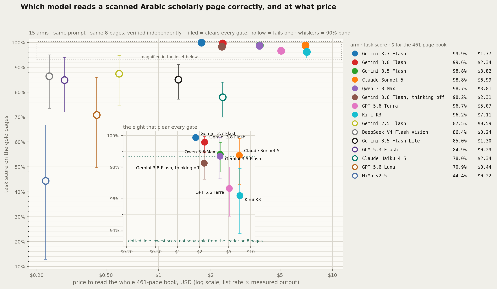

# Arabic page-extraction benchmark

**Which vision model should read a scanned Arabic scholarly book, and how much of what goes wrong
is the model versus what you asked it for?**

I needed an answer for a real pipeline: a reading app over digitised Arabic patristic texts, with
tap-to-open footnotes and read-aloud narration. Its OCR stage was a vision model reading page images,
and its output had problems. This repo is how the model was chosen. 22 arms, 20 pages, every arm
sees the same images, and prompt and model are varied separately so the two can be told apart.



## The answer

Measured on **8 pages** against `truth/gold/`, a reference produced outside the ranked set (see
[How accuracy is measured](#how-accuracy-is-measured)). Full tables, including the 20-page
agreement layer and every arm's failure detail, are in [RESULTS.md](RESULTS.md).

| model | task score | 90% band | $/page | 461-page book |
|---|---:|---:|---:|---:|
| Gemini 3.7 Flash | 99.9% | 99.8–100.0 | $0.00070 | $0.32 |
| Gemini 3.5 Flash | 98.8% | 97.7–99.6 | $0.00069 | $0.32 |
| Claude Sonnet 5 | 98.8% | 96.9–99.8 | $0.01517 | $6.99 |
| Qwen 3.8 Max | 98.7% | 97.3–99.9 | $0.00826 | $3.81 |
| GPT 5.6 Terra | 96.7% | 94.9–98.0 | $0.01100 | $5.07 |
| Kimi K3 | 96.2% | 93.8–97.9 | $0.01542 | $7.11 |

Five more models (DeepSeek V4 Flash Vision, GLM 5.3 Flash, Claude Haiku 4.5, GPT 5.6 Luna,
MiMo v2.5) fail one or more of the gates below and are reported but not ranked. The Gemini
prices in this table count candidate tokens only, not thinking tokens; see the thinking bullet
below for what that hides.

- **The top four cannot be separated on this evidence, and they span 22× in price.** The leader's
  margin over Sonnet falls to +0.15 points if a single evaluation page is dropped. The decision the
  data actually supports is: pick on cost, not on rank.
- **Most of the damage was the prompt, not the model.** A 100-page audit of the production
  pipeline's output found 365 defects, and **75% were structural**: running head in the body, page
  number in the body, footnotes merged, footnote text in the body. Not misreadings. The model
  returned a flat blob of text because a flat blob is what the prompt asked for, and a parser then
  tried to rebuild structure that was never marked. The same model on a schema prompt fixes most
  of it (arm B versus arm C: same model, same pages, different prompt).
- **Asking one call to transcribe and annotate costs the transcription.** P3 (blocks plus
  references) reads at 97.03% body agreement against P2's 99.47%. A second, text-only pass over
  P2's finished transcription returns the identical 135 references with P2's reading intact, for
  49% more money per page.
- **The rule was fixed before the scores were read.** Gates: all 8 evaluation pages answered,
  body accuracy ≥ 0.95, footnote F1 ≥ 0.8, anchor F1 ≥ 0.8. Among arms that clear them the ranking
  is a weighted score over what the product depends on: prose 35%, note text 15%, anchor placement
  15%, block order 10%, heading position 10%, fields 10%, marker fidelity 5%.
- **Turn thinking off.** The benchmark's runners never saw thinking tokens, so its Gemini prices
  are a floor. A later measured run of the real production call against the same gold pages
  ([measured_production/FINDINGS.md](measured_production/FINDINGS.md)) found that on Gemini 3.8
  Flash thinking was 74% of billed output, and that switching it off moved body accuracy from
  99.85% to 99.75% while cutting the price 2.6×, from $0.007184 to $0.002746 per page, and making
  the worst page a quotable number instead of a 1.7× surprise. On this task the thinking budget
  buys nothing measurable.
- **The 2.5 Flash caution is now answered, the other way.** The benchmark never ran the
  production model on the structured prompt and said the evidence did not show it to be a worse
  reader. The measured run closed that cell: 76.50% body accuracy, the wrong block count on 4 of 7
  pages, and one page where it emitted far more text than the leaf carries. The prompt is
  necessary; 2.5 Flash cannot use it. The fix in production was both.

## How accuracy is measured

There are two layers of truth in this repo, and only one of them is accuracy.

- **`truth/gold/` — 8 pages, the only ranking evidence.** Each page was transcribed twice,
  independently, by a model that is not an arm in this benchmark (Claude Opus 5; the ranked Claude
  arms are Sonnet 5 and Haiku 4.5). Each reading saw only the page image and the P2 instruction,
  never another reading and never an arm's output. The two readings were diffed exactly on every
  scored field, and every disagreement was settled against the page image and written down in
  `truth/ADJUDICATION_LOG.md` and `truth/_resolutions.json`. Five pages agreed outright; three
  needed adjudication. Page 93 was additionally checked by hand in the original audit. This is
  independent *of the arm pool*, which is what makes ranking possible. It is not a scholar's
  collation, and a misreading shared by both readings would survive.
- **`truth/pNNN.json` — 20 pages, agreement only.** Structural facts adjudicated from where the
  arms agree. It measures conformity to this pool of arms, so it is scored leave-one-out (an arm
  never votes on its own rubric), reported as **agreement**, and never ranks a model.

The 8 pages were chosen on printed features alone, one per axis that makes this corpus hard,
before any arm was scored against them. `truth/EVAL_SET.md` records the selection rule, the
rationale, and where the rationale turned out to be wrong.

## The corpus

20 pages of a 461-page Arabic scholarly edition of Justin Martyr, *الدفاعان والحوار مع تريفون*
(the two Apologies and the Dialogue with Trypho). Running heads, a dense numbered footnote
apparatus, printed page numbers in Arabic-Indic digits, printer signature marks, and Greek and
Latin quotations embedded in right-to-left prose. It is representative of the whole class of
digitised patristic and classical Arabic texts.

Pages were chosen for a difficulty spread, not just worst cases. Ten carry known production
defects; five are medium; three are light; two are clean controls where an arm that reports
problems is inventing structure. The hard cases include a running head that is the same word as
the page title, an apparatus that opens with the unnumbered tail of a note continued from the
previous leaf, footnote numbers glued to the previous note's text, a Western `9` printed among
Arabic-Indic markers, and the Greek word γενεά stored by production as the digit string `٧٤٧٤٨`.

**Rights.** The ancient text is public domain; this edition's translation, apparatus and
typesetting are modern work. The 20 page images and their transcriptions are included here, 4% of
the book, for the non-commercial purpose of evaluating extraction tools, with credit to the people
who made the edition: translation from the English by Amal Fouad; review against the English by
Dr. Irini Thabet George and Mariam Saad Mina; review against the Greek by Dr. Girgis Gamal Fayez;
Arabic language review by Dr. Wagdi Rizk Ghali; general review and subject index by Dr. Emad
Maurice Iskandar; introduction, final and theological review by Dr. Joseph Maurice Faltas. If you
hold rights in this edition and want the pages removed, open an issue and they will be.

## The five prompts

| | asks for | why it exists |
|---|---|---|
| **P0** | flat text with one `[FOOTNOTE]` marker | the production prompt, verbatim. A control. |
| **P1** | a field per printed element | does naming the parts fix the structure? |
| **P2** | one ORDERED sequence of typed blocks, plus inline footnote anchors | P1 returns headings in a list parallel to the body, which loses *where* the heading sits. 6 of 20 pages carry a heading and every one has several paragraphs, so P1 cannot rebuild 30% of the corpus. |
| **P3** | P2 plus references, people, works and dates | semantic extraction, kept separate on purpose: annotation is interpretation, not transcription, and asking for it may cost reading accuracy. P2-vs-P3 on one model measures that price. |
| **P4** | references, from text that is ALREADY transcribed | the fix for P3. It never sees the image, so it cannot alter a character of the reading. |

**A new model is always added on P2.** Only P2 arms are ranked, because only P2 asks for
everything the product needs. P0 does not measure whether a model can read the page; it measures
whether it can guess what we wanted, because it is never told. The two P0 arms are marked
`control: true` and exist only to establish the baseline and to prove the prompt is the cause.

## Repo map

```
arms.yaml            the arm registry — the only file you edit to add a model
prompts/             P0 flat · P1 schema · P2 ordered blocks · P3 + references · P4 second pass
pages/               the 20 page images + the production pipeline's own extraction (arm A)
runs/<arm>/          one JSON per page, per arm
truth/gold/          THE REFERENCE: 8 pages, read twice outside the arm pool, adjudicated
truth/EVAL_SET.md    which 8 pages, chosen before any scoring, and why
truth/pNNN.json      the older structural truth over all 20 pages (agreement layer)
measured_production/ a later measured run of the real production call against the gold pages:
                     thinking tokens counted, corrected prompt, raw rows and outputs, FINDINGS.md
tools/metrics.py     normalisation, CER/WER, structural scores, P0 structure recovery
tools/gold.py        accuracy against truth/gold/ — the only ranking evidence
tools/gold_merge.py  diff two independent readings; refuses to write a disputed page
tools/test_gold.py   self-check: every assert is a way this scoring was once wrong
tools/score.py       -> results.json   (gold accuracy + leave-one-out agreement)
tools/build.py       -> index.html     (the whole benchmark, one self-contained page)
tools/results_md.py  -> RESULTS.md     (the written findings, generated from results.json)
tools/chart.py       -> assets/accuracy-vs-cost.png
tools/report.py, tools/inspector.py, tools/app.js, tools/_tpl.txt   chart primitives, page inspector, page behaviour and template used by build.py
tools/run_gemini_api.py    run an arm through the Google API (returns real token counts)
tools/run_opencode.ps1     run an arm through the opencode CLI, one call per page, resumable
tools/run_codex.ps1        the same, through codex exec
tools/run_second_pass.py   P4 over an existing arm's transcription (never re-reads the image)
```

Regenerate everything:

```
pip install -r requirements.txt
python tools/score.py && python tools/build.py && python tools/results_md.py && python tools/chart.py
python tools/test_gold.py        # 12 invariants, each one a bug this repo once shipped
```

## Adding a model — three steps, no code

1. Add a block to `arms.yaml`:
   ```yaml
     - id: G_yourmodel_P2
       label: "Your Model · blocks"
       model: your-model
       prompt: P2
       role: what this arm is here to isolate
       runner: "how you invoked it"
       pricing: {input: 0.50, output: 2.00, source: list}
   ```
2. Write its outputs to `runs/G_yourmodel_P2/pNNN.json`, one per page, in the schema
   `prompts/P2_blocks.txt` specifies.
3. Run the regenerate line above.

The arm appears in every table and chart automatically. An arm listed with no run directory is
reported as pending rather than breaking the run.

## Rules the harness enforces on itself

Each one exists because it was a mistake that would have produced a flattering, wrong result.

- **Every number called accuracy comes from `truth/gold/`, and nowhere else.** `scored/eligible`
  is printed beside every aggregate.
- **An unmeasured metric is `None`, never `0.0`.** A flat prompt has no block sequence to check;
  that prints as an em dash, not as a zero that reads "tried and failed". Coverage is printed next
  to any composite built from a partial set, so an arm cannot look good by being measurable on less.
- **An ambiguous slot is left unscored.** Page 3 is a credits page where "page title or section
  label?" has no correct answer. Deciding it by coin-flip and scoring six arms against the result
  would be worse than a gap.
- **Price provenance travels with the price.** Every cost carries `measured`, `list`, or `proxy`,
  and the report prints it, so a borrowed price row can never be read as real billing.
- **The baseline is scored through a parser.** Flat-text arms are run through the same heuristics
  production uses (line 1 is the header, `[FOOTNOTE]` blocks are notes, trailing number is the page
  number). That is the real architecture being compared: a model never asked what anything *is*,
  plus a parser guessing afterwards.
- **Anchors are scored against gold, not against themselves.** An earlier version of this README
  said the anchors checking out against the notes was a score "that needs no ground truth, because
  the page checks itself". That was self-consistency, not correctness: a model that invents a note
  *and* an anchor for it agrees with itself perfectly, and one arm scored 1.0 on a page whose real
  note count is zero. The self-consistency figure is kept only as a diagnostic.

## The cost model

Calibrated, not assumed. `gemini-2.5-flash` OCR of this book cost a **measured $0.001881/page**
across 468 billed calls. Subtracting image and prompt input at list price leaves 707 output tokens,
and the same 139 pages average 1,392 output characters: **1.97 characters per output token** for
this script. JSON output tokenises differently (2.75–2.79, measured from the API's own usage
metadata). Every arm's cost is derived from measured output characters through those constants,
except where the API reported real token counts, which are used directly and marked `measured`.

Validation: the model predicts **$0.001776/page** for the production arm against the
**$0.001881** actually billed, 5.6% error on a figure it was not fitted to page-by-page.

Arms that ran through a flat-rate subscription are priced at the vendor's published per-token
rate against measured output volume, and say so in `arms.yaml`. That is a public price, not an
invoice.

**What this model misses.** The API runner recorded `candidatesTokenCount` only, and the CLI
arms derive cost from visible output characters. Gemini bills thinking tokens at the output rate
on the 3.x line, so every Gemini 3.x figure in this repo's results is a floor, not a bill. The
run in `measured_production/` read `thoughtsTokenCount` and folded it in; with thinking on, the
real number was 2.6× the floor. The comparison between models is unaffected. The absolute price
of a Gemini arm is, unless thinking is off.

## Two defects the benchmark found in itself, deliberately not fixed

**The recommended prompt teaches with a wrong example.** `prompts/P2_blocks.txt` illustrates the
anchor-versus-numeral distinction with a worked example about page 24, and the example is wrong
twice: the numerals it cites are years, not chapter references, and one of them is not in the body
at all. Both gold readers caught it independently. The principle is sound and it did no measurable
harm (across all twelve P2/P3 arms, not one anchored those numerals), but it asserts a fact about
the corpus that the corpus does not contain. It is left unchanged because every P2 arm ran against
this exact text; editing it now would decouple the published results from the prompt that produced
them. Fix it in the next run and re-run the P2 field, which is itself a worthwhile experiment.

**The schema has no way to say a paragraph continues.** P2 gives footnotes a
`continuedFromPreviousPage` flag but gives blocks nothing equivalent. Six of the eight evaluation
pages open or close mid-sentence. A reader that does not know a paragraph runs on will render it
as complete, and a read-aloud voice will speak a full stop the page does not print. Two booleans
per block, opens-mid-sentence and closes-mid-sentence, would fix it at no cost in output size.

Both are fixed in the production prompt, `measured_production/structured_v1.txt`, which is what
the measured run used. The benchmark arms still ran against the original, on purpose.

## Not yet done

- **Gold on the rest of the corpus.** 8 of 20 pages carry it. Three more have both readings
  finished and can be merged with `tools/gold_merge.py`; the rest need reading. This is the only
  thing that could separate the top four.
- **Repeated runs.** One sample per page, so run-to-run variation within a model is not in the
  published band. The band is a floor on the uncertainty, not all of it.
- **Open-weight vision models** (Qwen-VL, InternVL, Llama Vision). They need a different cost
  axis: GPU-seconds and hardware, not $/token.
- **Gemini 3.5 Flash Lite on P2 and P3, and 3.7 Flash on P3** were declared and never run: the
  billed key ran out of credit and the subscription route serves no Lite tier.
- **The `uncertain` lists.** Each gold reading records the glyphs it could not settle (a shadda
  against a fatha, a tatweel against a hyphen). The scorer does not read them yet. Most are
  folded away by normalisation before anything is compared, but not all.

## Opening the report

`index.html` is fully self-contained: page images, data and script are embedded, and there are no
network dependencies beyond the web font. Open it from disk or serve it from anything.

It begins with `<meta charset="utf-8">`, and that line is load-bearing. A server that sends no
charset (`python -m http.server` does not) leaves the browser to guess, it guesses Windows-1252,
and every Arabic character renders as mojibake. The bug only ever shows up locally, which is
exactly where it is easiest to mistake for a data problem.

## License

Code and scoring under [MIT](LICENSE). The page images and transcriptions are the edition's; see
[Rights](#the-corpus) above.
